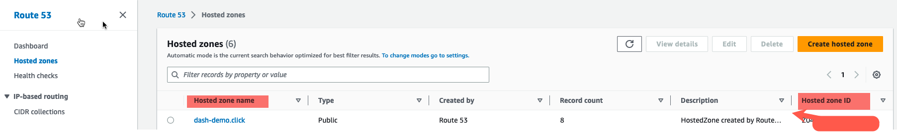
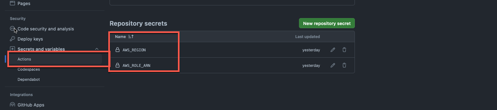

## Overview

This directory includes the Github actions job that can be used to deploy the required infrastructure to host the flask application in AWS. 

### [1.deploy-api-infra.yml](1.deploy-api-infra.yml)

The Github Action job allows you to either Plan, Deploy or Destroy the terraform template. You must also setup the region where you want it to be deployed in [dev.tfvars](https://github.com/cristianstoichin/flask_terraform_github_actions/blob/main/infrastructure/variables/dev.tfvars#L1).

This Github Action is designed to create the resources defined [here](https://github.com/cristianstoichin/flask_terraform_github_actions/tree/main/infrastructure#flask-api-template)

Before running the Job (manual trigger), you must first have the following Github Repo Secrets setup:

1. `AWS_ROLE_ARN`
   - This must be an existing Role in your AWS account that will allow the job to run the `aws cloudformation deploy` command.
      - Typically, this role is granted Admin permissions in AWS. However, be aware that this could pose a security risk. AWS recommends using the least privileged permissions for enhanced security.
2. `AWS_REGION`
   - This is required by the `aws-actions/configure-aws-credentials@v1` Github action that connects to your AWS account to get temporary credentials to be able to deploy the changes to the S3 bucket.
3. `hosted_zone_name`
   - This is a pre-requisite before running the deployment. You must have a Route53 hosted zone (public) that will be used to validate the ssl certificate.

#### AWS Route53 Example

  

#### Github Secrets Example

  

